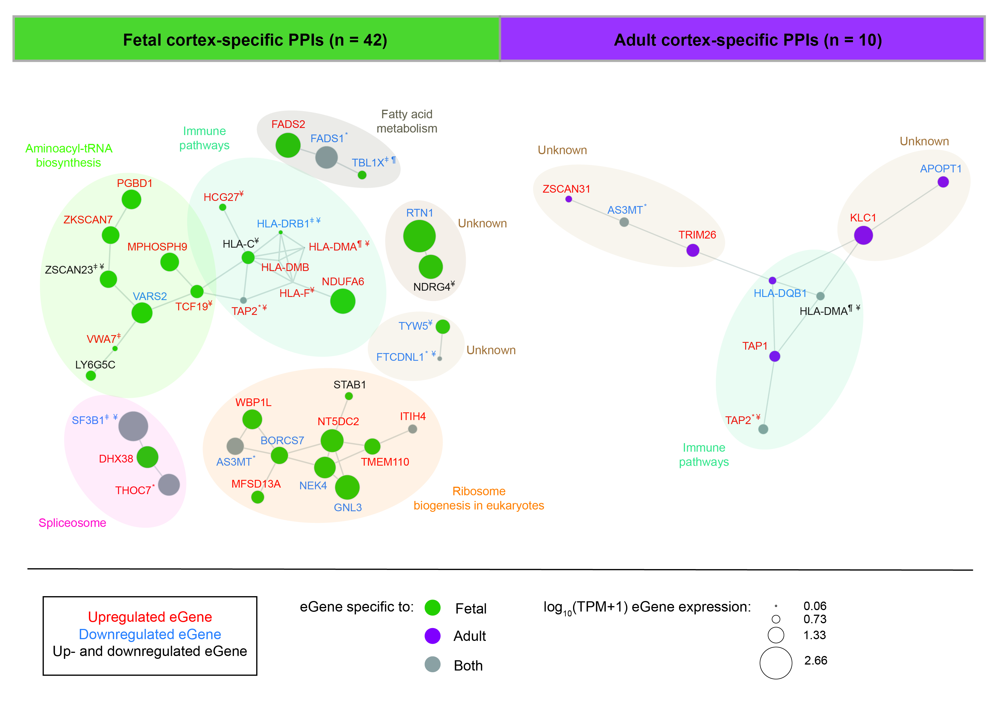

# Understanding the impact of SNPs associated with autism spectrum disorder on biological pathways in the human fetal and adult cortex

This repository contains scripts, data, results, figures and reproducibility report for "Understanding the impact of SNPs associated with autism spectrum disorder on biological pathways in the human fetal and adult cortex" study published in [Scientific Reports](https://www.nature.com/articles/s41598-021-95447-z). In this study, we integrated ASD-associated GWAS SNPs with cortex-specific 3D genome structure and eQTL information to identify genes that are spatially regulated in fetal (14-21 postconceptional weeks) and adult (21-70 years of age) cortical tissues. We incorporated cortex-specific expression patterns and PPI networks to identify candidate genes and pathways that have putative roles in the etiology of ASD-associated changes in the cortex. 

Python (version 3.6.9), R (version 4.0.2) and RStudio (version 1.2.5033) were used for data processing, analysis and visualisation.  

1. Fetal brain cortical plate and germinal zone neuron Hi-C data are available via the [dbGaP](https://www.ncbi.nlm.nih.gov/gap/) (accession: phs001190.v1.p1). Adult dorsolateral prefrontal cortex Hi-C data is available on [GEO](https://www.ncbi.nlm.nih.gov/geo/) (accession: GSE87112).  
2. Total RNA-seq and WGS datasets across GTEx v8 tissues are available via the [dbGaP](https://www.ncbi.nlm.nih.gov/gap/) (accession: phs000424.v8.p2). Total RNA-seq and genotyping datasets for fetal brain cortical tissue from 14-21 postconceptional weeks (PCWs) are available via the dbGaP (https://www.ncbi.nlm.nih.gov/gap/) (accession: phs001900.v1.p1).  
3. Human genome build hg38 release 75 (GRCh38) (Homo_sapiens_assembly38_noALT_noHLA_noDecoy.fasta) was downloaded from [gs://gtex-resources](https://console.cloud.google.com/storage/browser/gtex-resources/references).
4. SNP genomic positions for genome GRCh38p7 build 151 were obtained from ftp://ftp.ncbi.nih.gov/snp/organisms/human_9606_b151_GRCh38p7.  
5. Gene annotation for GENCODE v26 (gencode.v26.GRCh38.genes.gtf) was downloaded from [gs://gtex-resources](https://console.cloud.google.com/storage/browser/gtex-resources/references).  
6. Roadmap Epigenomics Project 15-state ChromHMM models for adult dorsolateral prefrontal cortex (E073_15_coreMarks_hg38lift_mnemonics.bed.gz) and fetal brain (E081_15_coreMarks_hg38lift_mnemonics.bed.gz) were downloaded from https://egg2.wustl.edu/roadmap/data/byFileType/chromhmmSegmentations/ChmmModels/coreMarks/jointModel/final/ on 22/11/2020.  
7. SNPs associated with ASD were downloaded from the [GWAS Catalog](www.ebi.ac.uk/gwas/) on 05/04/2020.  
8. GWAS SNP-trait associations (gwas_catalog_v1.0.2-associations_e100_r2020-08-26.tsv.gz) were downloaded from [GWAS Catalog](https://www.ebi.ac.uk/gwas/docs/file-downloads) on 26/08/2020.  
9. A curated list of 1,237 genes that had been previously implicated in autism development was downloaded from [AutDB](http://autism.mindspec.org/autdb/Welcome.do;jsessionid=9EC2C3BDD4F54A2223B757AE42B22E7A) (accessed on 16/11/2020).  
10. The STRING PPI network (version 11.0, protein.links.full.v11.0.txt.gz) was downloaded from https://string-db.org/ on 24/09/2020.  

We identified 42 PPIs in the fetal and 10 PPIs in the adult cortical tissues. Louvain clustering identified seven PPI modules within the fetal cortex that were enriched for immune pathways, fatty acid metabolism, aminoacyl-tRNA biosynthesis, spliceosome, ribosome biogenesis in eukaryotes and two unknown modules. Adult PPIs form three modules that were enriched in immune pathways and two unknown modules.
